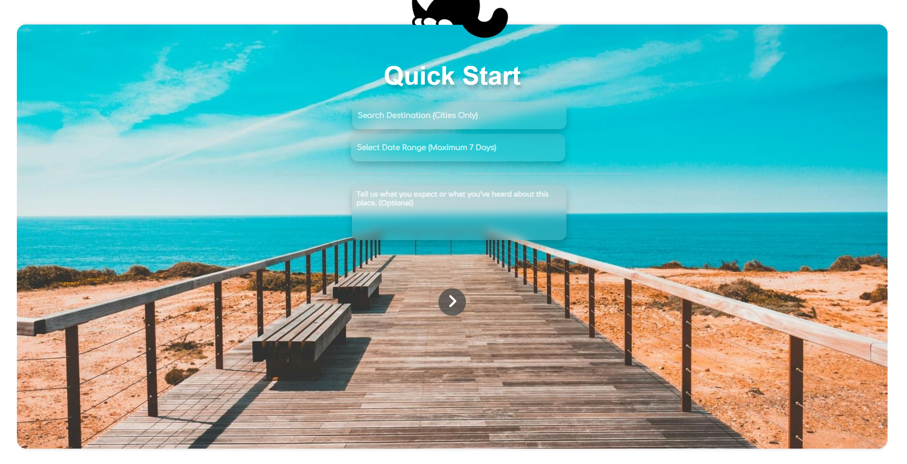
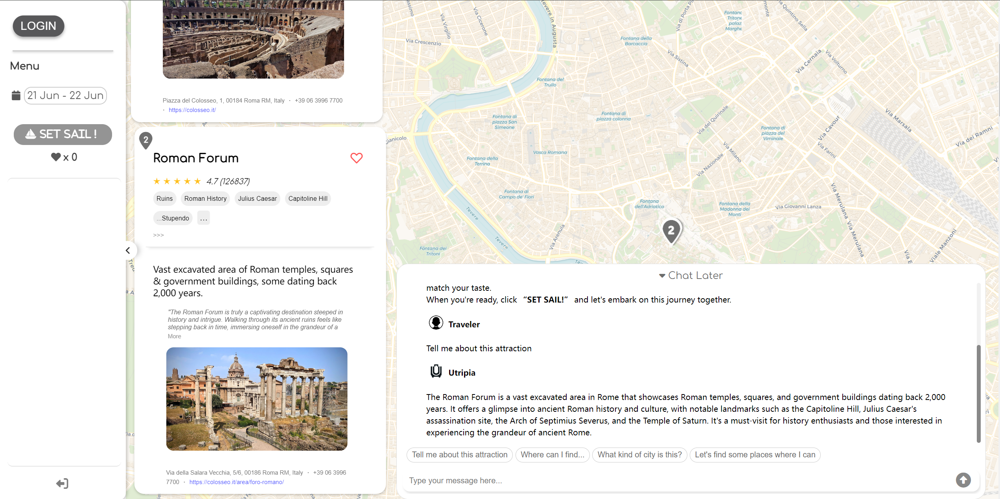
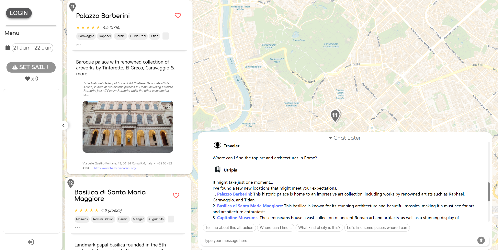
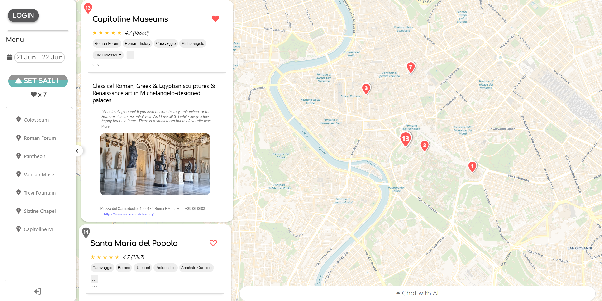
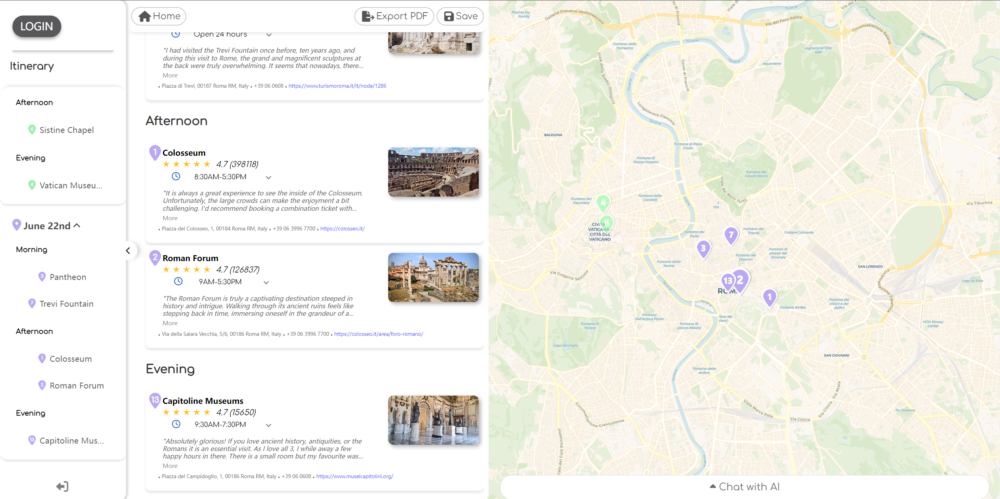
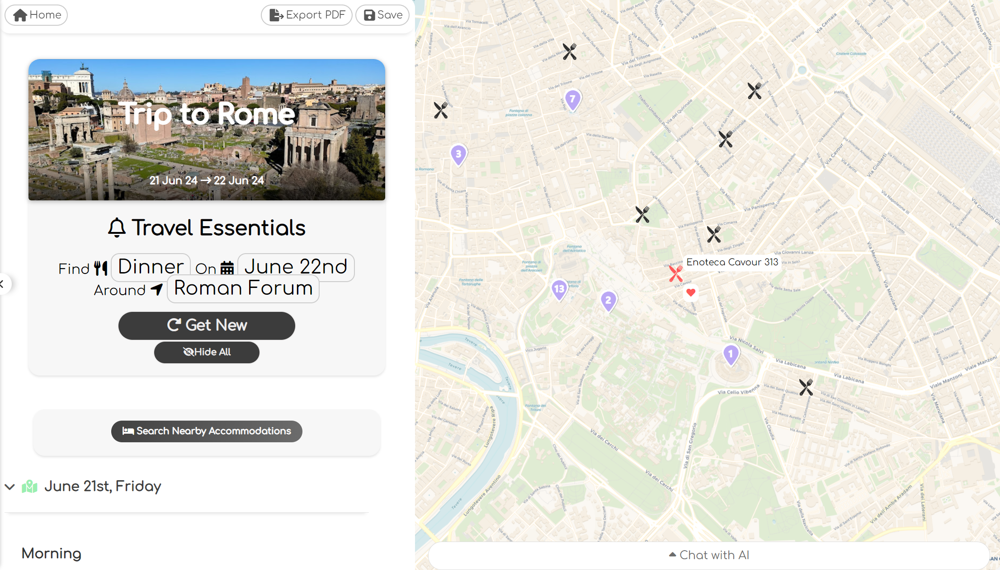

# Utripia-showcase

This is a page to introduce Utripia.ai, an AI-powered travel recommendation website.

#🌍✈️🧳🗺️🚗🏨🏖️📍

# https://www.u-tripia.com/
## Project Overview
Utripia.ai is an AI-powered travel recommendation website designed to help users easily plan and explore travel destinations. The website leverages advanced AI technologies to provide personalized travel recommendations and real-time communication.

## Key Features
- **Real-time Communication:** Allows users to chat with the AI to get information about various attractions and cities.
- **Intent Recognition:** Understands user preferences and suggests relevant attractions based on their interests.
- **Dynamic Map Updates:** Uses OpenLayers to dynamically update map markers based on user interactions.

## Technology Stack
- **Backend:** Python, Flask, MongoDB
- **Frontend:** JavaScript, HTML, CSS
- **AI Integration:** GPT, Gemma, Llama, Gemini, Langchain
- **Automated Travel Route Planning:** Automatically plans travel routes to avoid time conflicts and prioritize saving travel distance, while also allowing users to modify the routes.

## Screenshots and Instructions
1. **Enter Destination:** Start by entering at least the first three letters of your desired destination.
2. **Select Dates:** Choose the dates for your trip.
3. **Specify Preferences:** Optionally, specify particular types of attractions or the kind of experience you are looking for.

*Screenshot of the homepage.*

### Real-time Communication

**Ask for Recommendations:** Allows real-time communication with users, providing relevant information about the attractions or cities they are interested in.

*Screenshot of the real-time communication feature1.*

**Update Locations:** Parse users' intentions and update and display locations based on their preferences.

*Screenshot of the real-time communication feature2.*

### Set Sail

**Select Enough Locations:** Once you have chosen enough destinations, click on "Set Sail!" to experience the AI-planned itinerary.

*Screenshot of the 'Set Sail' feature.*

### Automated Travel Route Planning

1. **Automatic Route Planning:** The system will automatically plan your travel route to avoid time conflicts and minimize travel distance.
2. **Modify Routes:** You can manually adjust the suggested routes to better fit your preferences.
   

*Screenshot of the automated travel route planning feature.*

### Choose Restaurants and Accommodations

**Select Nearby Options:** After finalizing your itinerary, you can choose restaurants or accommodations near your selected attractions to complete your travel plans.
   

*Screenshot of the restaurant and accommodation selection feature.*

### Save and Share

1. **Save Your Itinerary:** Once your trip is planned, you can save the itinerary for future reference.
2. **Print and Share:** You can also print your itinerary or share it with others.

